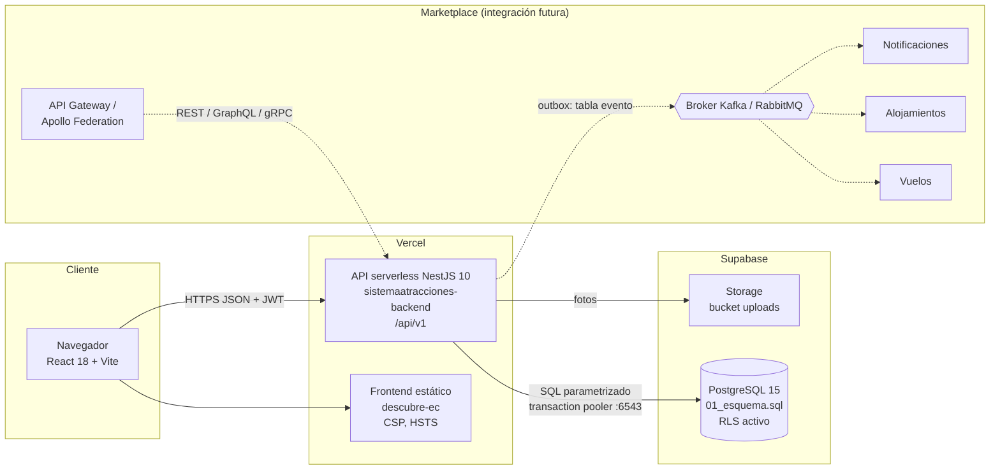
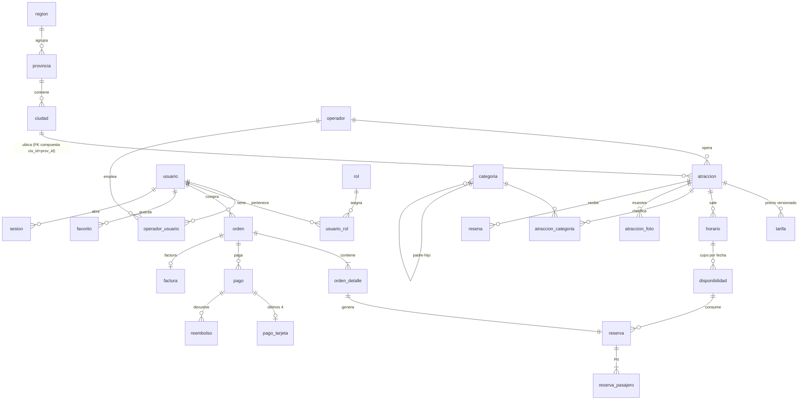
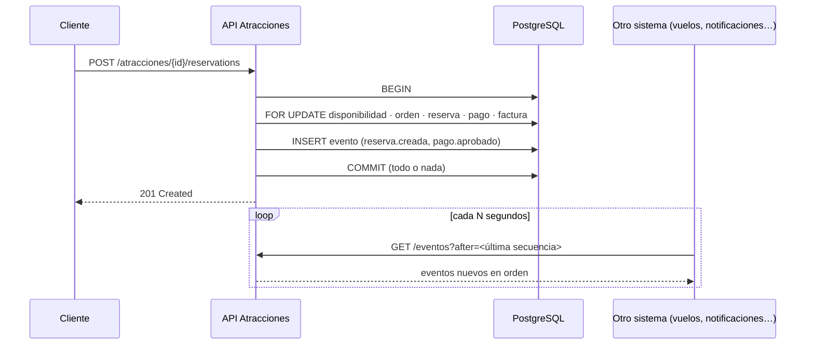

# Descubre EC · Documentación técnica

Dominio de **Atracciones** del marketplace *Booking Prototipo* (Integración de Sistemas). Este documento cubre la arquitectura, el modelo de datos, las APIs y el diseño de integración.

| Recurso | URL |
|---|---|
| Sitio (marketplace) | https://descubre-ec.vercel.app |
| Panel de administración | https://descubre-ec.vercel.app/admin |
| API REST | https://sistemaatracciones-backend.vercel.app/api/v1 |
| Swagger (implementación) | https://sistemaatracciones-backend.vercel.app/api/docs |
| Redoc (contrato OpenAPI) | https://sistemaatracciones-backend.vercel.app/api/redoc |
| Estado (API + base de datos) | https://sistemaatracciones-backend.vercel.app/api/v1/atracciones/health |
| Contratos publicados | https://sistemaatracciones-backend.vercel.app/api/v1/contracts |

---

## 1. Arquitectura

- **Frontend** (`frontend/`): SPA con sitio público (buscar, detalle, reservar, mis reservas) y panel de administración (catálogo, reservas, disponibilidad, personas, reportes, integración). Accesibilidad WCAG 2.1 AA (axe: 0 violaciones).
- **Backend** (`backend/`): NestJS por módulos de dominio.

| Módulo | Responsabilidad | Tablas principales |
|---|---|---|
| `atracciones` | Catálogo, búsqueda, disponibilidad, compras/reservas, reseñas, reportes, favoritos | atraccion, tarifa, horario, disponibilidad, orden, reserva, pago, factura, resena |
| `auth` | Identidad: registro, login JWT, sesiones, usuarios y roles | usuario, rol, usuario_rol, sesion, operador_usuario |
| `contacto` | Mensajes del formulario de contacto | mensaje_contacto |
| `integracion` | Feed de eventos (EDA) y contratos publicados | evento |
| `common` | Acceso a datos, seguridad, idempotencia, errores RFC 7807, bitácora | idempotencia, bitacora |

Capas de una petición: **guardas** (JWT + scopes OAuth2, throttling, Idempotency-Key) → **controlador** (valida DTO con class-validator) → **servicio** (reglas de negocio y transacciones) → **SQL parametrizado** (`DbService`) → PostgreSQL. `AtraccionMapper` traduce las filas (español) al contrato (inglés).

## 2. Modelo de datos

Fuente: [`database/01_esquema.sql`](../database/01_esquema.sql) (43 tablas en 3FN, convención `<sigla>_id`) + [`database/03_eventos.sql`](../database/03_eventos.sql). Verificación: [`database/02_verificacion.sql`](../database/02_verificacion.sql) (`npm run db:verify`, también en CI).

Decisiones clave del modelo:

- **Inventario explícito**: `disponibilidad` guarda el cupo de cada fecha y horario. Reservar bloquea esa fila (`SELECT … FOR UPDATE`) y la sobreventa es imposible también por el `CHECK dis_cupo_reservado <= dis_cupo_total`.
- **Precio congelado**: `tarifa` se versiona (`tar_vigente_desde/hasta`) y `orden_detalle`/`reserva` guardan el precio aplicado.
- **Separación comercial**: orden → detalle → reserva; el pago cuelga de la orden (puede reintentarse) y el reembolso del pago (un trigger impide reembolsar más de lo cobrado).
- **PII aislada**: los datos del pasajero viven en `reserva_pasajero`; los eventos no llevan datos personales.
- **Identificadores**: PK internas BIGINT/SMALLINT; el contrato expone UUID (`atr_uuid`, `res_uuid`).
- **Seguridad**: RLS en todas las tablas y sin permisos para `anon`/`authenticated` (la API REST automática de Supabase no expone nada).
- **Migraciones SQL-first**: `backend/src/database/sql/NNN_*.sql` (001 = copia exacta de `01_esquema.sql`, verificada por un test), registro en `ops.migracion`, aplicadas en el build de Vercel.

## 3. APIs

| Recurso | Métodos | Scope |
|---|---|---|
| `/atracciones/search`, `/atracciones/details` | POST | público |
| `/atracciones`, `/atracciones/{id}` | GET · POST · PUT · PATCH · DELETE | lectura pública; escritura `attractions:write` |
| `/atracciones/{id}/availability` (+ `/calendar`) | GET | público |
| `/atracciones/{id}/reservations` | POST (Idempotency-Key) | `attractions:book` |
| `/atracciones/reservations`, `/{id}`, `/{id}/cancel`, `/{id}/confirm` | GET · POST | `read` / `cancel` / `manage` |
| `/atracciones/{id}/reviews`, `/{id}/blocked-dates` | GET · POST · DELETE | público / `book` / `manage` |
| `/categorias`, `/destinos`, `/operadores`, `/provincias`, `/idiomas` | CRUD / GET | escritura `attractions:write` |
| `/auth/*`, `/usuarios` | registro, login, logout, perfil; administración | `admin:full` |
| `/reportes/*`, `/resenas`, `/mensajes`, `/uploads` | panel | `manage` / `admin:full` |
| `/favoritos` | GET · PUT · DELETE | usuario autenticado |
| `/eventos`, `/contracts` | GET | `admin:full` / público |

Convenciones (contrato `backend/contracts/atracciones-openapi.yaml`): prefijo `/api/v1`, UUID, `Idempotency-Key` en operaciones transaccionales, errores RFC 7807 (`application/problem+json`), HATEOAS (`_links`), scopes OAuth2 en el JWT, `X-Request-Id`, `X-Total-Count`, límites de peticiones (`429` + `Retry-After`).

## 4. Integración futura (API-First, SOA y EDA)

| Contrato | Archivo | Uso |
|---|---|---|
| REST (OpenAPI 3.0) | `backend/contracts/atracciones-openapi.yaml` | Contrato acordado antes de implementar; validado con Redocly en CI |
| Eventos (AsyncAPI 2.6) | `backend/contracts/atracciones-asyncapi.yaml` | 8 eventos de dominio y su formato |
| GraphQL (Federation 2) | `backend/contracts/atracciones.graphql` | Subgrafo con `Atraccion`, `Reserva` y `Ciudad` como entidades `@key` |
| gRPC | `backend/contracts/atracciones.proto` | Consultas y reservas entre servicios internos |

**Eventos de dominio (patrón Transactional Outbox)**

Eventos: `reserva.creada`, `reserva.confirmada`, `reserva.cancelada`, `pago.aprobado`, `pago.reembolsado`, `atraccion.publicada`, `atraccion.actualizada`, `atraccion.retirada` (prefijo `atracciones.`). Entrega *al menos una vez* con deduplicación por `id`. Al migrar a microservicios, un *relay* publicará las filas pendientes (`evt_publicado_en IS NULL`) en el broker sin cambiar a los productores.

**Puntos de integración concretos**: el subgrafo de vuelos puede extender `Ciudad @key(codigoInec)` para ofrecer vuelos al destino de una atracción; alojamientos puede escuchar `reserva.creada` (ciudad y fecha) para sugerir estadías; notificaciones puede escuchar `reserva.*` y `pago.*`.

## 5. Seguridad

JWT (2 h) con sesión revocable (`sesion`), permisos recalculados desde `usuario_rol` en cada petición, bcrypt, throttling (login 5/min), helmet (CSP, HSTS), CORS restringido, validación estricta de entrada y dominios de la base (`dom_correo`, `dom_ruc`, `dom_documento`), subida de imágenes por *magic bytes*, bitácora de acciones administrativas, datos de tarjeta nunca completos (solo marca y últimos 4 dígitos).

## 6. Despliegue y calidad

- **GitHub → Vercel**: cada push a `main` despliega frontend y API; `npm run vercel-build` aplica las migraciones pendientes antes de publicar.
- **CI** (`.github/workflows/ci.yml`): lint, tipos, 30 tests unitarios, build, `npm audit`, gitleaks y un job con PostgreSQL que aplica el modelo, carga datos y ejecuta `02_verificacion.sql`; además valida el contrato con Redocly.
- **Variables** (Vercel): `DATABASE_URL`, `DB_SSL`, `DB_POOL_MAX=1`, `JWT_SECRET`, `JWT_EXPIRES_IN`, `SUPABASE_*`, `PUBLIC_URL`, `FRONTEND_URL`, `VITE_API_URL`.
